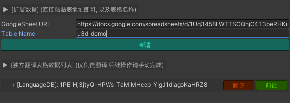

# Guru L10n 多语言翻译机 (Unity版本)

**Version 0.0.2**

## 介绍

该工具利用AI针对已知的语言(语种)进行翻译. 以提升团队的研发效率.

Unity版本工具依赖项目中的 I2 Localization 插件

## 工具介绍

工具入口: `Guru/Localization/L10N`, 进入本工具页面.
- Sheet ID: 请联系中台获取该表格的 SheetID.
- Table: 需要手动设置为项目名称
- 点击 <u>导出并上传</u>, 完成数据上行, 包括创建表格
- 点击 <u>下载并导入</u>, 完成数据下行, 自动导入到 I2 组件中

注意:
- 工具会生成一部分缓存文件.

## 工作流程

### **初始化语言Code**

- 点击 `补全默认语言` 来建立中台支持的 `76` 种语言
- 如果是老项目, 也需要点击 `补全默认语言` 来整理原有配置的语言, <u>但是因为手动输入的问题, 可能会导致部分 Code 出现空值, 空值的语言需要手动删除. </u>

### **多语言更新流程**

- 客户端在本地建立和新增语言(语种): 例如: zh-CN :: Chinese (Simplified), ru (Russian) 等  

- 利用本工具将 I2 插件内的项目导出为特定的格式, 并上传至指定的 GoogleSheet 

- 等待, AI会在翻译的表格建立好之后, 自动进行翻译 (30~120分钟不等, 视条目数量而定)

- 提交 ASO 审查, ASO会修复翻译中不合适或者错误的内容.

- 利用本工具下载最新数据, 并导入 I2 组件内, 翻译内容会自动填充

  
### 额外扩展

说明

- 由于部分项目的额外需求, 有时候会出现部分翻译内容不依赖 `I2 Localization` 的情况
- 项目的多语言已经翻译完成, 但是需要单独触发一下翻译修改某几个语言的内容
- 以上情况都可以使用扩展表格来直接调用翻译动作.

使用方式:
- 拷贝需要单独触发翻译动作的表格地址, 填入 `GoogleSheetUrl`, 表格的名称填入 `Table Name` 中
  
- 点击新增添加保存独立表格数据
- 点击数据条目上的 `翻译` 按钮来触发直接翻译操作

- 注意:
  > 扩展表格的功能 **仅能** 触发目标表格的翻译行为, 无任何后继动作的关联
  >   
  > 翻译后会生成名为 `_gen` 开头的新表, 真正的翻译内容在 `_gen` 表内, 原表仍然是空白的.
  > 
  > (2023-09-18更正)  
  > 对于 <u>已经确认翻译过</u> 的词条, 进行任何后期的优化和改动, 不要在客户端内修改, 需要直接在线上工作表内进行修改, 只修改词条本行的EN文本内容, 行内其余语言的单元格手动清除, 之后再进行 `上传` 操作后才能继续进行翻译. 
  >  
  > 单独修改某个词条的内容, 需要清除原表和 `_gen` 表内对应的所有单元格, 再触发 `翻译` 才有效果

## 已知问题

- 工程内会在项目根目录内生成 `.guru/l10n/backup.csv`, 请保留该文件并随工程一起提交至版本控制系统, 用于备份文本记录. 
- 工作表格单元格 `A2` 上有人工锁, ASO翻译完成后如果 *忘记* 取消勾选, 会导致拉取失败. 这时候可以手动取消即可正常拉取.
- 工具依赖于Google 接口, 因此需要梯子, 拉取失败请看日志相关的内容.
- 目前本工具还处于实验阶段, 线上翻译有可能中断, 发现长时间无响应的情况, 请及时联系中台 @huyufei
- 翻译出现问题后,若数据未填充, 请不要执行拉取.
- AI 翻译语言功能有限, 准确度偏低, 目前还需要大量的训练.
- 请及时备份项目中的数据, 以防预期外的问题导致数据丢失. 😭

