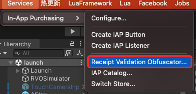

# Guru IAPService

- Version 0.9.1

- Guru 支付服务标准化接口

## 接入说明

### 配置 Unity 的 IAP 功能

#### (1) 安装 In App Purchasing 插件

- 打开 PackageManager, 安装 `In App Purchasing` (4.5.2) 版本

#### (2) 开启 Unity 的 IAP 服务

- 进入 Edit/Project Settings/Services/In-App Purchasing 面板
   
  
  
- 初始需要登录账号, 必须使用公司的 Unity 账号:
  > audiofirst2020@gmail.com  
  >  
  > Castbox123
  >
- 该账号需要选择邮箱登录, 有两步验证, 如需要获取验证码, 请联系 **@朱凯莉** 获取手机验证码
- 下拉框选择组织 `audiounity`
- 如果是新项目, 选择创建 `project ID`
  
  

- 选择若干创建项目的选项, 问到年龄时可以选择13岁以下, 然后项目创建完毕
- 首先将该项目的 Settings 开关打开: **OFF** -> **ON**
- 然后点击 `Dashboard` 直接进入网页版后台 (后面的设置在网页端会比较方便)

  

- 进入后台后先选中刚才创建的项目, 准备输入Google License Key

  

- 进入该项目对应的GooglePlayConsole 后台, 找到 `Financial reports/Monetization setup`
- 复制 `Base 54-encoded RSA public key` 然后回到 Unity 控制台页面, 粘贴刚才的代码.

  

- 返回Unity内, 可关闭Service面板, 然后在菜单上打开 `Services/In-App Purchasing/Receipt Validation Obfuscator...`

  

- 在面板内, 再次黏贴刚才的代码, 之后点击 `Obfuscator Google Play License Key` 生成对应的文件

  

- 最后在默认的路径 `Scripts/UnityPurchasing/generated` 下会生成对应的Tangle文件

  

- 注意: 这些文件可以移动到任意的路径, 保存好在后面的支付验证中会有用.

</br>

---

### 继承 IAPServiceBase

- 完成支付插件配置后, 将生成的文件导入后, 请删除 `GuruIAP/__NeedBeReplaced__` 的这个文件夹. 由于这个文件夹内是占位的文件. 需要被真正生成的文件替换
- 接下来需要编写对应游戏内容的 `IAPService`, 需要继承自 `IAPServiceBase` 基类
- 其中必要的接口, 需要根据游戏逻辑, 返回 `blevel` 的值
- 其他逻辑根据游戏可进行扩展

```C#
using UnityEngine.Purchasing;

namespace Guru.Sample
{
    public class MyIAPService: IAPServiceBase<MyIAPService>
    {
        /// <summary>
        /// 必须实现 BLevel 反回值, 用于支付打点上报 
        /// </summary>
        /// <returns></returns>
        protected override int GetBLevel()
        {
            return UserData.Instance.GetLastFinishedLevel(); // 游戏目前进度完成的最后一关
        }
        
        public override void Init(bool showLog = false)
        {
            base.Init(showLog);
            InitGameProducts();
        }

        private void InitGameProducts()
        {
            // 插入项目专用的初始化逻辑
            foreach (var key in Products.Keys)
            {
                var info = Products[key];
                if (info.Setting.Type == ProductType.Subscription)
                {
                    // TODO: 针对订阅行道具进行处理逻辑
                }
            }
        }
    }
}

```

- 在项目中正常调用对应的支付服务逻辑:

```csharp
public class MyDemoApp: MonoBehaviour
{
    private void Awake()
    {
        // 初始化回调
        MyIAPService.Instance.OnInitResult = success =>
        {
            if (success)
            {
                // UIManager.Instance.OpenStoreUI();
            }
        };
    }


    /// <summary>
    /// 点击支付按钮
    /// </summary>
    /// <param name="productId"></param>
    private void OnClickBuyItem(string productId)
    {
        MyIAPService.Instance.Buy(productId, (success, id) =>
        {
            if (success)
            {
                // UIManager.Instance.OpenPaySuccess();
            }
            else
            {
                // UIManager.Instance.OpenPayFail();
            }
        });
    }
}

```