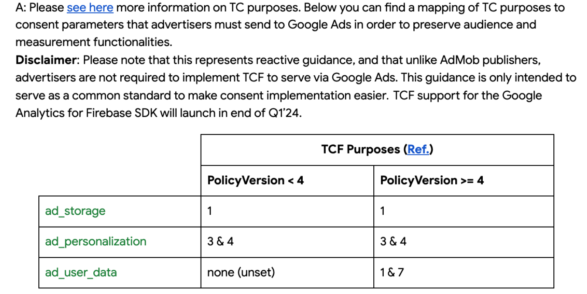
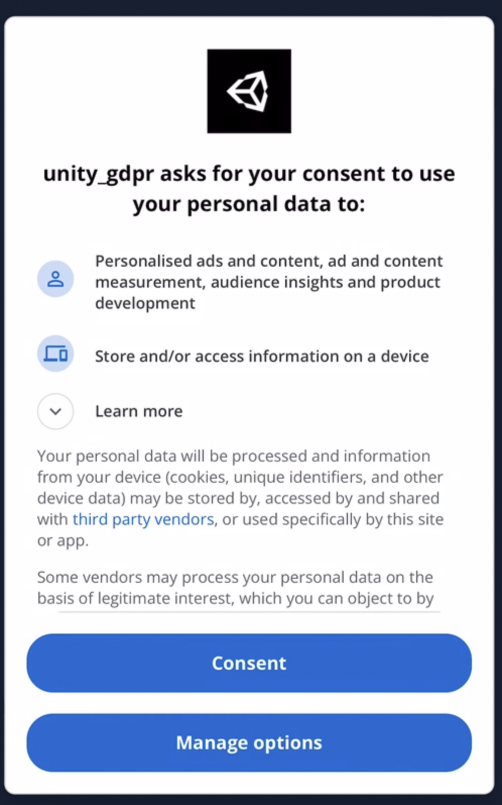
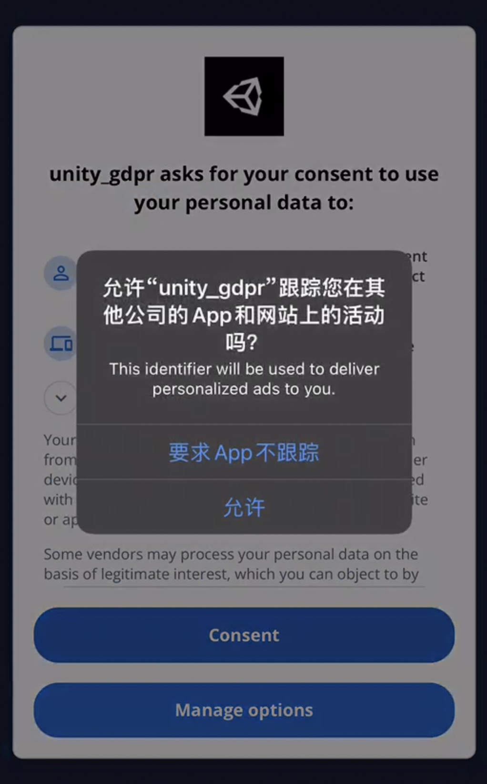
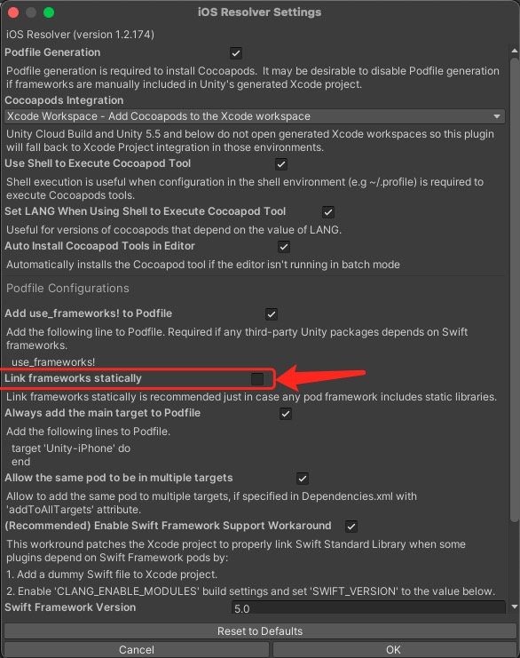

# Guru Unity Consent

## 1.0.9
* 更新 iOS 库版为本地 Pod 库， 直接引用源码 `1.4.6`
> 78dfe631fc97da53023577a7fcebb71400c3c873
* Anroid 库同步 github 仓库最新版本 `1.0.0`
> f8355aecfb36132c252d216331ad6d8f2c4b6363

## 1.0.8
* 更新 GuruConsent 的 iOS 库版本至 `1.4.6`
* 更新 iOS 库添加 Privacy Policy 的配置项
* 更新 iOS 依赖的 cocospods 库地址


## 1.0.7
* 更新 Consent 针对 Json 参数的回调和解析逻辑.


## 1.0.6
* 更新了Google DMA 合规策略, 请查询详细的 [Google Ads Consent Mode DMA合规 技术需求文档](https://docs.google.com/document/d/1p7ad-W6XnqPjMgFkvoVf1Yylsogm_PykD9_nauInVoI/edit#heading=h.42lwhi7yczmk)
* 已集成了中台的 `dma_gg` 点位
* 云控可控变量 `dma_map_rule`, `dma_country_check` 两个参数来改变 TFC 策略以及开启地区检测
* 采用了变现组提供的 Google 映射策略 (默认策略见下图)
- 
> 已知问题: 基于用户选择结果的 Purpose 在 iOS 上会产生乱码, 因此针对返回空串或非 "0","1" 的结果处理为非EEA地区的用户, 即不上报 DMA 数据

## 1.0.3
* 更新了SDKCallback对象的名称和逻辑, 同SDK本体进行区分


## 1.0.2

- 注意本插件库依赖 `LitJson` 用于解析Json格式数据. 请确保项目内引入此库.
- 使用了 *EDM* 插件实现自动依赖注入.
  </br>


---

## 插件接入

- 项目整合插件后, 只需在App启动的时候调用代码, 整个Consent流程会自动启动.

  ```C#
    void Awake(){

        // 无需回调的话可直接调用
        // GuruConsent.StartConsent();

        GuruConsent.StartConsent(OnGetConsentStatus);
    }

    /// <summary>
    /// 获取到 ConsentStatus
    /// </summary>
    /// <param name="status"></param>
    private void OnGetConsentStatus(int status)
    {
        string msg = $"[Unity] Get Status: {status}";
        Debug.Log(msg);
        //TODO 后继若有处理,可补全逻辑
    }
  ```
- 测试功能时请确保开启了**欧洲的VPN**, 比如开启英国或者德国的VPN来直接唤起GDPR
  
- iOS设备在点击 `Consent` 后会立即拉起 'ATT' 弹窗
  

---

</br>

## 插件注入:

本项目已开始使用 `ExternalDependencyManager` 简称 `EDM` 来解决各种库的依赖问题

详细配置可见: [Dependencies.xml](Editor/Dependencies.xml)

IOS 项目注意配置如下图:

--> 取消勾选 **Link frameworks statically**




## Android 平台配置说明

于主菜单 `BuildSettings/PlayerSettings/PubishSettings:`

开启如下选项:

- [x] Custom Main Manifest
- [x] Custom Main Gradle Template
- [x] Custom Properties Gradle Template

之后会在项目的 `Plugins/Android`内生成对应的文件.

(A) 修改 `AndroidManifest`

确保于 `<application>` 内添加本项目的 `GoogleClientID`, 例如:

```xml
<application>`

  ...

  <meta-data
          android:name="com.google.android.gms.ads.APPLICATION_ID"
          android:value="ca-app-pub-1234123412341234~5678567890" />
</application>

```

(B) 修改 `gradleTemplate.properties`

添加一下内容支持 `AndroidX`

```java
org.gradle.jvmargs=-Xmx**JVM_HEAP_SIZE**M
org.gradle.parallel=true
android.enableR8=false
unityStreamingAssets=.unity3d**STREAMING_ASSETS**
android.useAndroidX=true
android.enableJetifier=true
**ADDITIONAL_PROPERTIES**
```

(C) 修改 `mainTemplate.gradle`

于 `dependency` 内添加如下依赖

```java
dependencies {
    ...
    implementation 'androidx.appcompat:appcompat:1.1.0'
    implementation 'com.google.android.ump:user-messaging-platform:2.0.0'
    compile 'com.mapzen:on-the-road:0.8.1'
    ...
}

```

最低 `minTarget` 设置为 **21**

(D) 修改 `proguard-user.txt` 文件, 在最后追加此插件的相关代码

若项目使用了 ProGuard 压缩混淆, 需要修改此文件, 否则可能造成JAVA类无法被找到

```java
...
-keep class com.guru.** { *; }
-keep class guru.core.** { *; }
```


---

</br>


## iOS平台配置说明

- 先确 `Info.plist` 中经正确配置了 firebase 的应用ID
  ```xml
  <key>GADApplicationIdentifier</key>
  <string>YOUR-APP-ID</string>
  ```
- 确保 ATT 的文本配置也正确设置了
  ```xml
  <key>NSUserTrackingUsageDescription</key>
  <string>This identifier will be used to deliver personalized ads to you.</string>
  ```
- GDPR的构建管线([IOSPostBuild_GDPR](Editor/IOS_POST_GDPR/IOSPostBuild_GDPR.cs))会自动添加`pod`源和target, 确保不会和项目的POD产生冲突.


## 示例项目

- 示例项目位于 [~Sample](~Sample) 目录内.
- 示例借用了 WaterSortPuzzle 的 `AppID` 和 `BundleID`
- 示例项目可输入测试设备ID, 可在设备接入LOG显示的情况下, 第一次使用空DeviceID来请求设备ID, 会在LOG中显示. 然后再次打开应用, 输入ID, 即可模拟欧洲IP展示流程.
- 挂载欧洲VPN可直接进行请求. 并显示正确的GDPR流程


